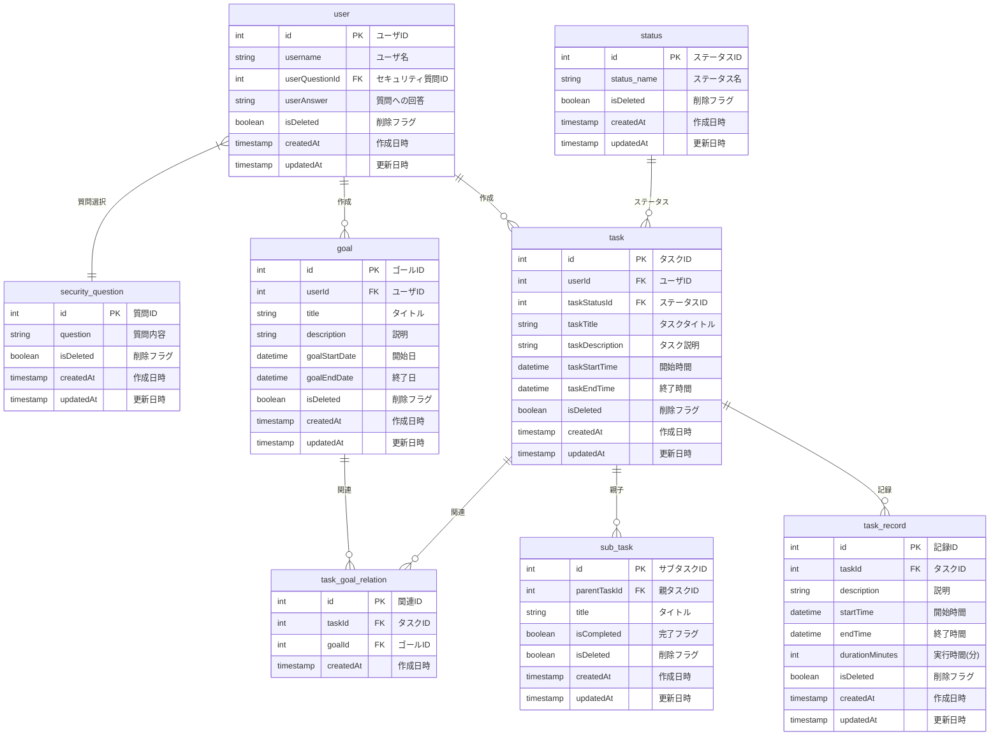

```mermaid
erDiagram
    %% ユーザーテーブル
    user {
        int id PK "ユーザID"
        string username "ユーザ名"
        int userQuestionId FK "セキュリティ質問ID"
        string userAnswer "質問への回答"
        boolean isDeleted "削除フラグ"
        timestamp createdAt "作成日時"
        timestamp updatedAt "更新日時"
    }

    %% セキュリティ質問テーブル
    security_question {
        int id PK "質問ID"
        string question "質問内容"
        boolean isDeleted "削除フラグ"
        timestamp createdAt "作成日時"
        timestamp updatedAt "更新日時"
    }

    %% ステータステーブル
    status {
        int id PK "ステータスID"
        string status_name "ステータス名"
        boolean isDeleted "削除フラグ"
        timestamp createdAt "作成日時"
        timestamp updatedAt "更新日時"
    }

    %% ゴールテーブル
    goal {
        int id PK "ゴールID"
        int userId FK "ユーザID"
        string title "タイトル"
        string description "説明"
        datetime goalStartDate "開始日"
        datetime goalEndDate "終了日"
        boolean isDeleted "削除フラグ"
        timestamp createdAt "作成日時"
        timestamp updatedAt "更新日時"
    }

    %% タスクテーブル
    task {
        int id PK "タスクID"
        int userId FK "ユーザID"
        int taskStatusId FK "ステータスID"
        string taskTitle "タスクタイトル"
        string taskDescription "タスク説明"
        datetime taskStartTime "開始時間"
        datetime taskEndTime "終了時間"
        boolean isDeleted "削除フラグ"
        timestamp createdAt "作成日時"
        timestamp updatedAt "更新日時"
    }

    %% サブタスクテーブル
    sub_task {
        int id PK "サブタスクID"
        int parentTaskId FK "親タスクID"
        string title "タイトル"
        boolean isCompleted "完了フラグ"
        boolean isDeleted "削除フラグ"
        timestamp createdAt "作成日時"
        timestamp updatedAt "更新日時"
    }

    %% タスク記録テーブル
    task_record {
        int id PK "記録ID"
        int taskId FK "タスクID"
        string description "説明"
        datetime startTime "開始時間"
        datetime endTime "終了時間"
        int durationMinutes "実行時間(分)"
        boolean isDeleted "削除フラグ"
        timestamp createdAt "作成日時"
        timestamp updatedAt "更新日時"
    }

    %% タスクとゴールの関連テーブル(必要に応じて)
    task_goal_relation {
        int id PK "関連ID"
        int taskId FK "タスクID"
        int goalId FK "ゴールID"
        timestamp createdAt "作成日時"
    }

    %% リレーション
    user ||--o{ goal : "作成"
    user ||--o{ task : "作成"
    user }|--|| security_question : "質問選択"
    
    status ||--o{ task : "ステータス"
    
    goal ||--o{ task_goal_relation : "関連"
    task ||--o{ task_goal_relation : "関連"
    task ||--o{ sub_task : "親子"
    task ||--o{ task_record : "記録"
```